# violinplus

`violinplus` provides template-driven violin and distribution plots for R and
BioAgentsAI public plotting workflows.

The package is built around selectable templates rather than one overloaded
plot call. Each template has a stable ID, thumbnail name, palette, description,
and default parameters so an online platform can show template cards and apply
the selected style directly.

```r
library(violinplus)

data <- violinplus_demo_data()

p <- violin_plot(
  data,
  x = "group",
  y = "value",
  fill_col = NULL,
  template = "raincloud",
  print_params = TRUE
)

save_violin(p, "raincloud.png")
```

The bundled demo data is intentionally richer than a toy example. It includes
four biomarkers, three treatment groups, two cohorts, two time points, response
classes, batch labels, paired subject IDs, units, feature IDs, a few flagged
outliers, and light missingness. The examples use a single long-format CSV,
`examples/violinplus-demo-data.csv`, so the same upload can drive every template
by changing only the template and mapping parameters.

```r
violin_template_examples()[, c("template", "claim", "filter_label", "x", "fill_col", "facet")]
```

Use `fill_col` when the x-axis grouping and color grouping should be different.
Legend position and facet columns are explicit controls:

```r
violin_plot(
  data,
  x = "pair",
  y = "value",
  fill_col = "group",
  legend_position = "bottom",
  facet = "facet",
  facet_cols = 2,
  orientation = "horizontal"
)
```

Available templates:

```r
violin_templates()[, c("id", "title", "description", "palette")]
```

The first release includes 14 templates:

- `violin_box`
- `violin_jitter`
- `box_jitter`
- `violin_only`
- `raincloud`
- `half_violin_box`
- `beeswarm_summary`
- `sina_density`
- `two_group_sig`
- `multi_group_sig`
- `violin_box_letter`
- `split_violin_letter`
- `paired_change`
- `facet_grid`

Each template uses a different journal-inspired default palette, including
NPG, Lancet, NEJM, JAMA, JCO, AAAS, Nature, and Cell-inspired combinations, so
template cards look visually distinct while staying close to common scientific
figure styles.

## Template gallery

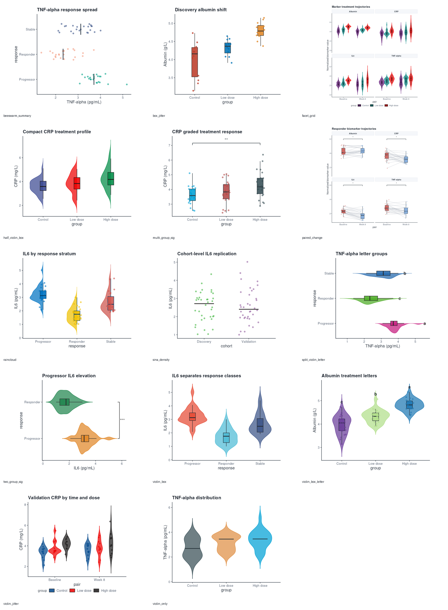

| Template | Preview |
| --- | --- |
| `violin_box` | 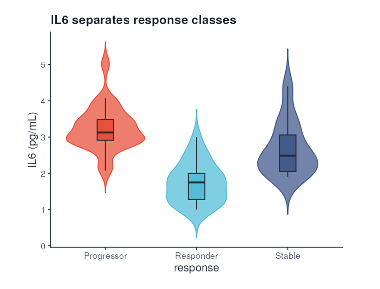 |
| `violin_jitter` | 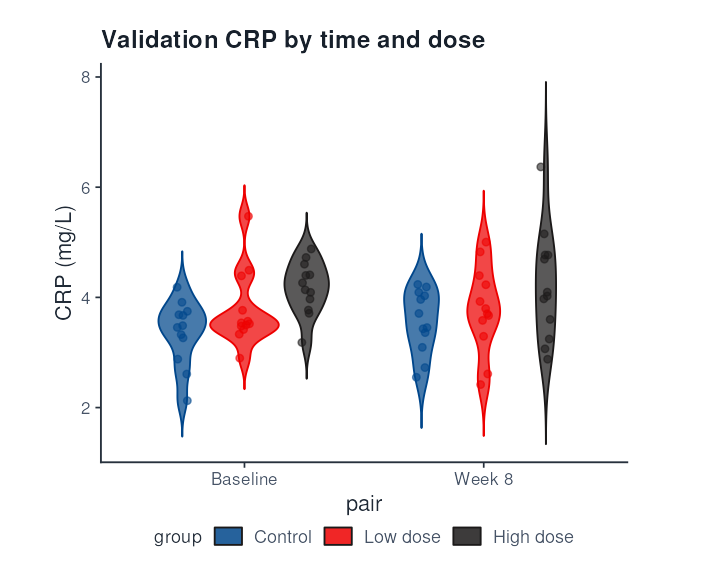 |
| `box_jitter` | 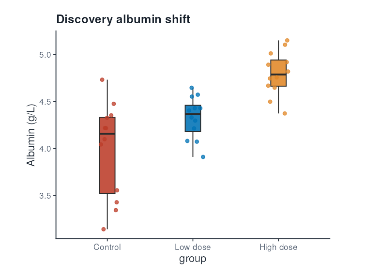 |
| `violin_only` | 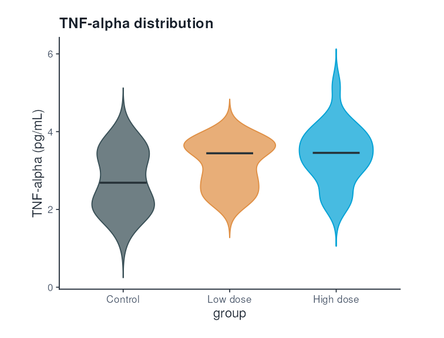 |
| `raincloud` | 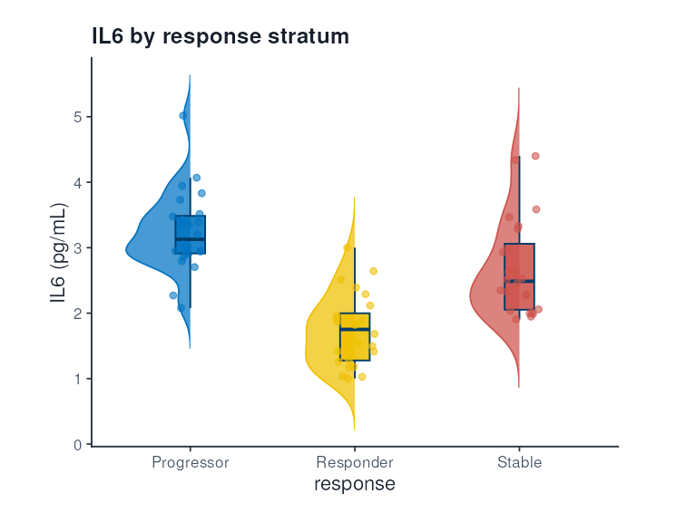 |
| `half_violin_box` | 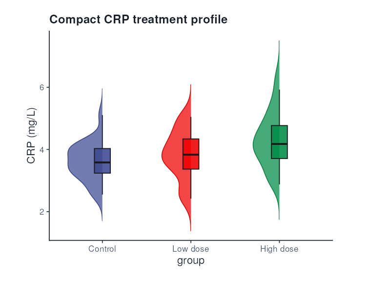 |
| `beeswarm_summary` | 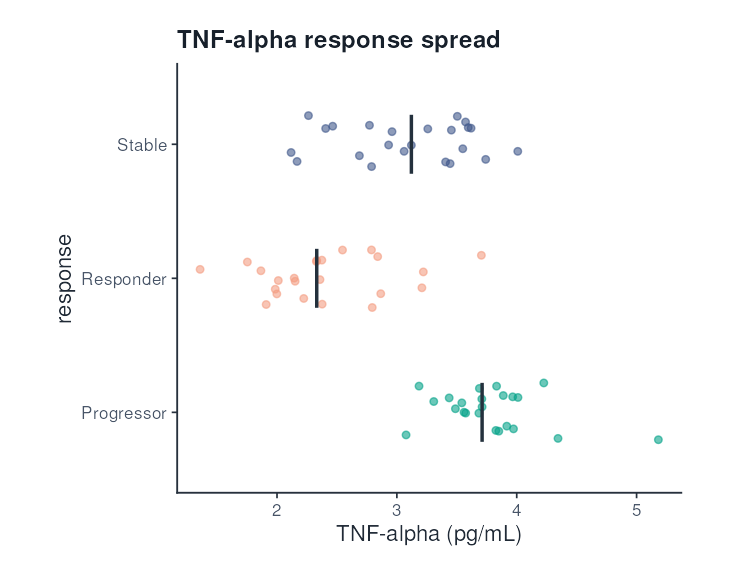 |
| `sina_density` | 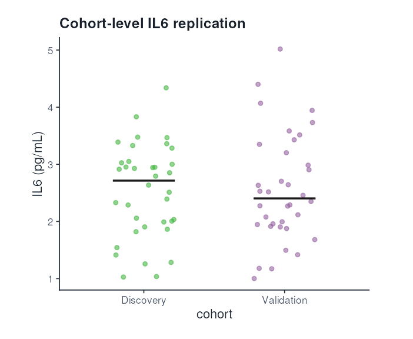 |
| `two_group_sig` | 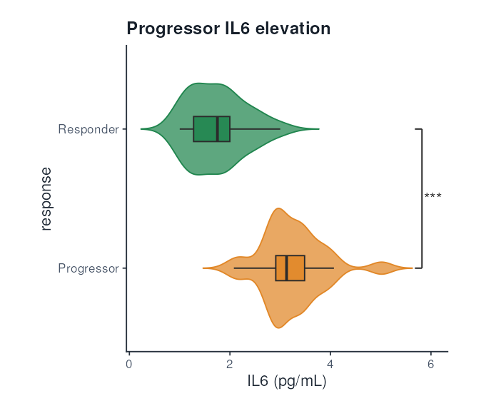 |
| `multi_group_sig` | 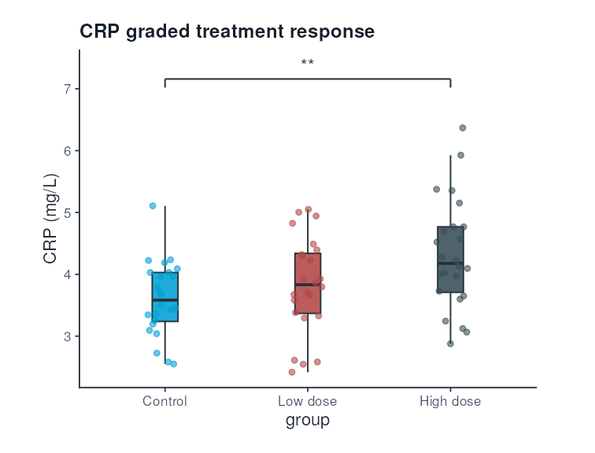 |
| `violin_box_letter` | 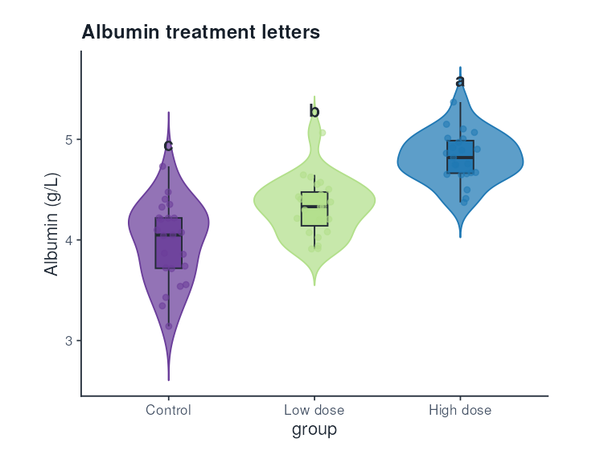 |
| `split_violin_letter` | 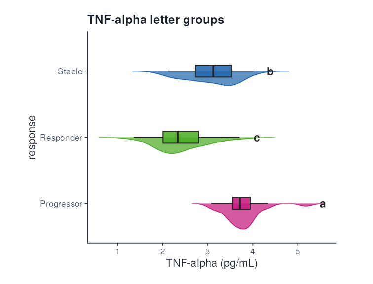 |
| `paired_change` | 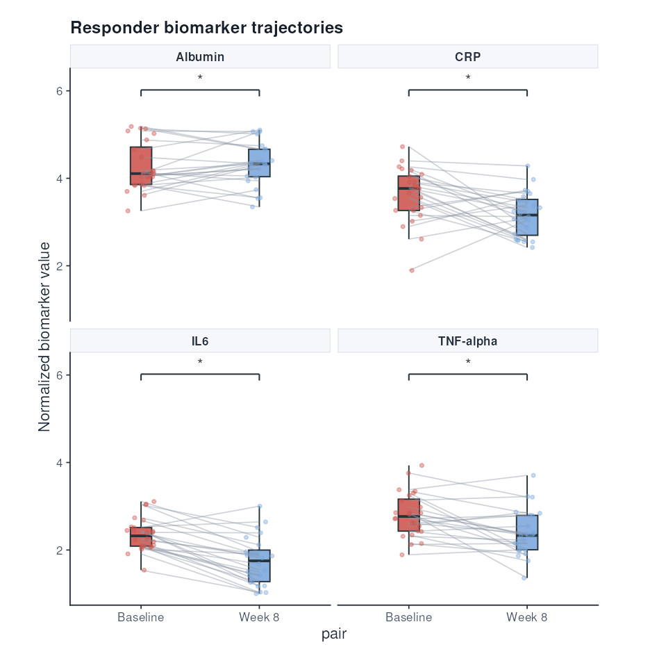 |
| `facet_grid` | 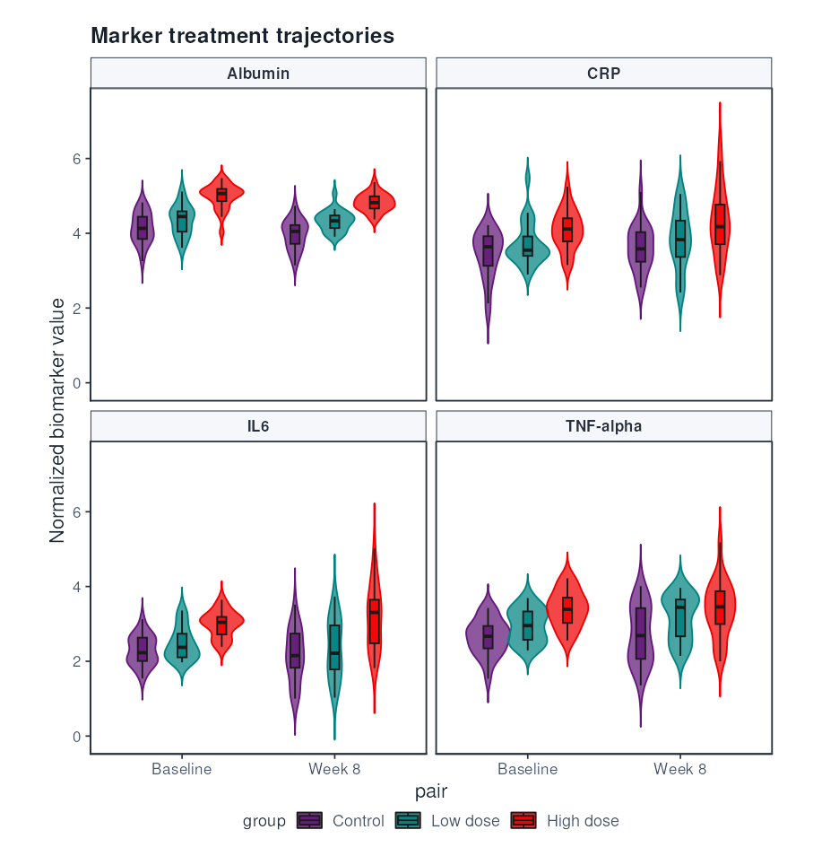 |
